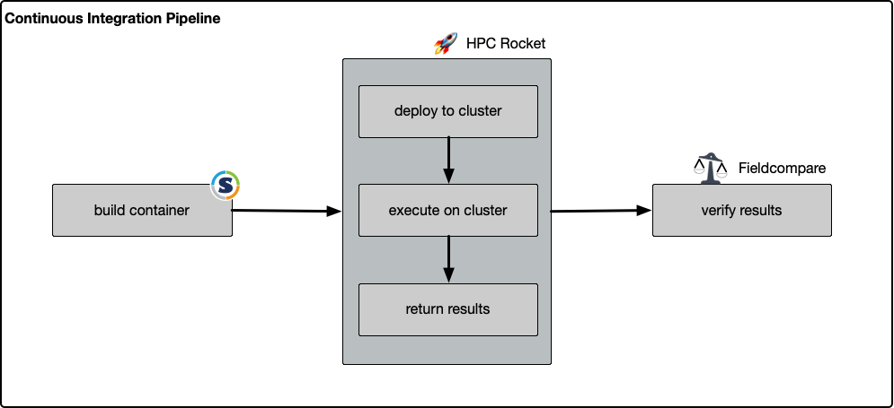

# SURESOFT HPC Workflow

## Introduction
This workflow shows how to automatically deploy containers to clusters and verify the results using continuous integration. It is developed as a showcase for the [SURESOFT](https://www.tu-braunschweig.de/suresoft) workflow addressing reproducibility on HPC platforms. The project includes a sample application of a 2D Laplace heat transfer in a plate.

## Workflow
The workflow is grouped into three [jobs](.gitlab-ci.yml) in the Continuous Integration pipeline using GitLab CI (see image below).

1. building the container
2. running the code on the cluster using [hpc-rocket](https://zenodo.org/record/7469695)
   1. deploys the container to the cluster via SSH
   2. executes the container (e.g. via SLURM)
   3. returns a defined set of files as the result
3. using [fieldcompare](https://gitlab.com/dglaeser/fieldcompare) to compare the results with reference data

### Prerequisite
The first CI-job, which builds the container, needs a **privileged** docker GitLab runner. This is necessary because it uses a docker image to build the singularity container. However, this is not needed if the container already exists.

## Files
### [.gitlab-ci.yml](.gitlab-ci.yml)
1. builds singularity image based on [Containers/rockylinux9-mpich.def](Containers/rockylinux9-mpich.def)
   - we are using a rockylinux base image, as our target platform is a CentOS 7
2. copy image with [hpc-rocket](https://zenodo.org/record/7469695) to cluster ([rocket.yml](rocket.yml)) and submit slurm job ([laplace.job](laplace.job))
   - it is necessary that REMOTE_HOST, REMOTE_USER and REMOTE_PASSWORD (or PRIVATE_KEY) are set in the GitLab CI project settings according to variable names in rocket.yml
3. verifies the result with [fieldcompare](https://gitlab.com/dglaeser/fieldcompare)

### [Containers/rockylinux9-mpich.def](Containers/rockylinux9-mpich.def)
- defines singularity image
- defines executing of binary file

### [rocket.yml](rocket.yml)
- defines files to copy to cluster
- defines result files to copy back to gitlab
- defines slurm job file to submit

### [laplace.job](laplace.job)
- slurm settings
- executes singularity image
