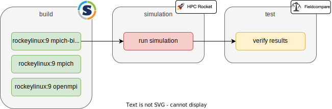
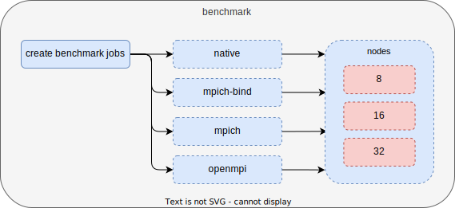
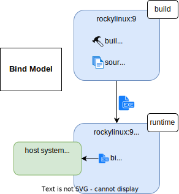
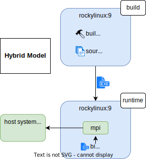
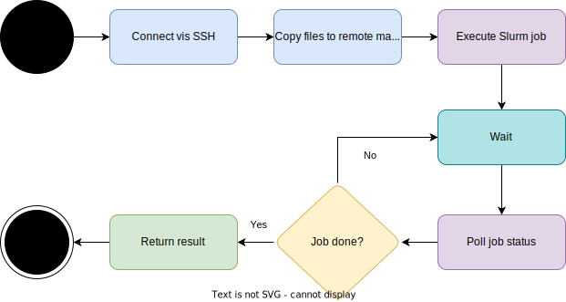

# SURESOFT HPC Workflow

## Introduction
This workflow shows how to automatically build and deploy containers to clusters and verify the results using continuous integration. It is developed as a showcase for the [SURESOFT](https://www.tu-braunschweig.de/suresoft) workflow addressing reproducibility on HPC platforms. The project includes a sample application of a 2D Laplace heat transfer in a plate.

## Workflow
The workflow is grouped into four [stages](.gitlab-ci.yml) in the Continuous Integration pipeline using GitLab CI (see image below).

1. **build**
   - builds containers with different MPI implementations (see [Singularity Images](#singularity-images)) using [Singularity](https://docs.sylabs.io/guides/3.10/user-guide/)
     1. Rocky Linux with MPICH using the [hybrid model](https://docs.sylabs.io/guides/3.10/user-guide/mpi.html#hybrid-model). Definition File: [rockylinux9-mpich.def](Containers/rockylinux9-mpich.def)
     2. Rocky Linux with MPICH using the [bind model](https://docs.sylabs.io/guides/3.10/user-guide/mpi.html#bind-model). Definition File: [rockylinux9-mpich-bind.def](Containers/rockylinux9-mpich-bind.def)
     3. Rocky Linux with OpenMPI using the [hybrid model](https://docs.sylabs.io/guides/3.10/user-guide/mpi.html#hybrid-model). Definition File: [rockylinux9-openmpi.def](Containers/rockylinux9-openmpi.def)

2. **simulation**
   - runs the image with MPI bind model on the cluster using [hpc-rocket](https://doi.org/10.5281/zenodo.7355861)
      1. deploys the container to the cluster via SSH
      2. executes the container (e.g. via SLURM)
      3. returns a defined set of files as the result

3. **test**
   - Runs a regression test with [fieldcompare](https://gitlab.com/dglaeser/fieldcompare) to compare the results of the simulation stage with reference data.

4. **benchmark**
   - Dynamically generates additional CI jobs to benchmark the performance of the different MPI approaches.

### Singularity Images

The `.def` files in the Containers directory define Singularity images using different MPI implementations and binding approaches. The singularity files are based on [rockylinux 9](https://rockylinux.org/) as the targeted remote system uses CentOS Linux 7.
All `.def` files are separated into two stages, a `build` and a `runtime` stage.
The `build` stage is used to compile the application, while the `runtime` stage only contains the dependencies necessary to run it.
This reduces size of the final image.
`rockylinux9-mpich.def` and `rockylinux9-openmpi.def` use the [hybrid model](https://docs.sylabs.io/guides/3.10/user-guide/mpi.html#hybrid-model) where MPI is installed on the host machine as well as inside the container. 
When running, the MPI on the host machine will communicate with the MPI instance inside the container. 
In practice this leads to a small performance overhead in comparison to a native solution.
`rockylinux9-mpich-bind.def` uses the [bind model](https://docs.sylabs.io/guides/3.10/user-guide/mpi.html#bind-model) where no MPI instance is installed in the container.
Instead the MPI installation of the host machine is mounted into the container.
This results in a performance on par with a native solution.
However, the portability of the container is reduced, since the application must be compiled with the same MPI version that is used on the host machine.

    

#### Prerequisite
The first CI-job, which builds the container, requires a GitLab Runner using a **privileged** [Docker Executor](https://docs.gitlab.com/runner/executors/docker.html). This is necessary because it uses a docker image to build the singularity container. However, this is not needed if the container already exists.

### HPC Rocket
HPC Rocket is a commandline tool to send slurm commands to a remote machine and monitor the job progress. 
It was primarily written to launch slurm jobs from a CI pipeline.

### [rocket.yml](example/rocket-mpich-bind.yml)
- defines files to copy to cluster
- defines result files to copy back to gitlab
- defines slurm job file to submit

### [laplace.job](example/laplace-mpich-bind.job)
- slurm settings
- executes singularity image

### Fieldcompare
`fieldcompare` is a Python package with command-line interface (CLI) that can be used to compare
datasets for (fuzzy) equality. It was designed mainly to serve as a tool to realize regression tests
for research software, and in particular research software that deals with numerical simulations.
In regression tests, the output of a software is compared to reference data that was produced by
the same software at an earlier time, in order to detect if changes to the code cause unexpected
changes to the behavior of the software. 

We use fieldcompare to compare the temperature field of the the 2d Laplace simulation with a predefined [reference dataset](reference_data/).

### Benchmarks
- matplot 

- dynamic CI pipeline
- jinja templates
  - slurmjob
  - rocket files
  - CI jobs
