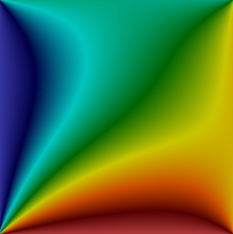

# Laplace2d
[](https://gitter.im/tu_bs_irmb/laplace2d?utm_source=badge&utm_medium=badge&utm_campaign=pr-badge)

[](https://sonarcloud.io/dashboard?id=irmb_Laplace2d)

## Description
This project includes several applications of a 2D Laplace heat transfer in a plate. It is developed for teaching purpose by the [iRMB](https://www.tu-braunschweig.de/irmb) at the TU Braunschweig.

It contains the following examples:
- Serial
- MPI
- Threads
- OpenMP
- CUDA

## Configure & Build
CMake will automatically search for the dependencies, such as CUDA, MPI or OpenMP. If one if them is not found, the related example will be skipped.

```bash
mkdir build && cd build
cmake ..
make
```

## Run example
Executables will be build into "bin" folder.

```bash
./bin/Laplace2D_serial
```

## Run unit test
Unit tests are build with the [catch2](https://github.com/catchorg/Catch2) framework, which will be automatically added to the project in the configure step.
The tests can be executed with

```bash
ctest
```
or
```bash
./bin/Laplace2d_tests
```

## Output data

As a result the executables will write [UCD](https://dav.lbl.gov/archive/NERSC/Software/express/help6.1/help/reference/dvmac/UCD_Form.htm) files into the build directory. Those files can be viewed with e.g. [Paraview](https://www.paraview.org/).


